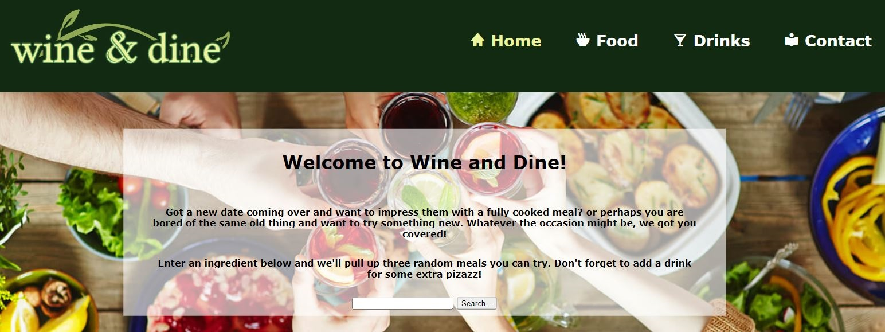

# Wine and Dine

## Description 


Our group was challenged to create a website using two server-side APIs, so we decided to come together and create a site that brings you some yummy meals! Drinks included 😉 


## Usage



To use Wine and Dine, input a main ingredient into the search bar (i.e. chicken, beef, asparagus, etc) and you'll immediately be greeted with 
three random meals. Each meal comes with a list of ingredients and directions on how to make it. 

We also created a random drink function. Most of us have our main go-to cocktails, so we decided to spice things up and make it completely random so you can try something new! To do so, click the 'Random Drink' button and you'll find an image of the cocktail, its ingredients and how to make it. If you want to save the drink recipe for later, you can click our 'Save Drink' button and access it in the future. 

Sound tasty? Check it out <a href="https://rtm713.github.io/WiningAndDining/">here</a>


## User Story
```
AS A hungry home-body
I WANT to cook using ingredients I already have
SO THAT I don't have to drive to the grocery store

```

## Acceptance Criteria
```
GIVEN the homepage of Wine and Dine
WHEN I click a link in the navbar 
THEN I am taken to the corresponding spot on the page
WHEN I hover over links
THEN I see the the text change color
WHEN I search for an ingredient
THEN I am presented with three meals
WHEN I am present with three meals
THEN I see an image, the ingredients, and the recipe for those meals
WHEN I click the Random Drink button
THEN I am presented with a cocktail
WHEN I am presented with a cocktail I can see an image, list of ingredients, and recipe for said cocktail
WHEN I click the Save Drink button
THEN I save that cocktail recipe to local storage
WHEN I click the GitHub and LinkedIn icons
THEN I am taken to their corresponding links
WHEN I view Wine And Dine on my phone
THEN I am greeted with a design that is easy to navigate

```


## Credits 
Javascript - <a href="https://github.com/haileyraehughes89">Hailey Hughes</a> & <a href="https://github.com/rtm713">Travis Meyer</a>
<p></p>
HTML & CSS - <a href="https://github.com/ZacWheeler3">Zac Wheeler</a> & <a href="https://github.com/IvySMac">Ivy McCurdy</a>
<p></p>
Food API - <a href="https://spoonacular.com/food-api">Spoonacular</a>
<p></p>
Drinks API - <a href="https://www.thecocktaildb.com/api.php">TheCocktailDB</a> 
<p></p>
This site is used strictly for educational purposes only 


